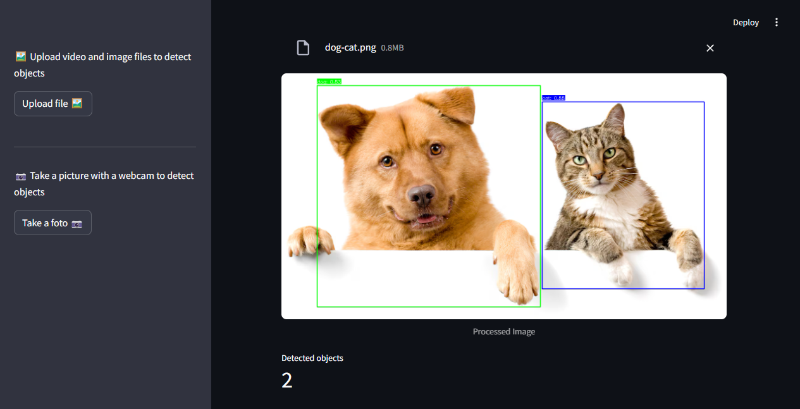
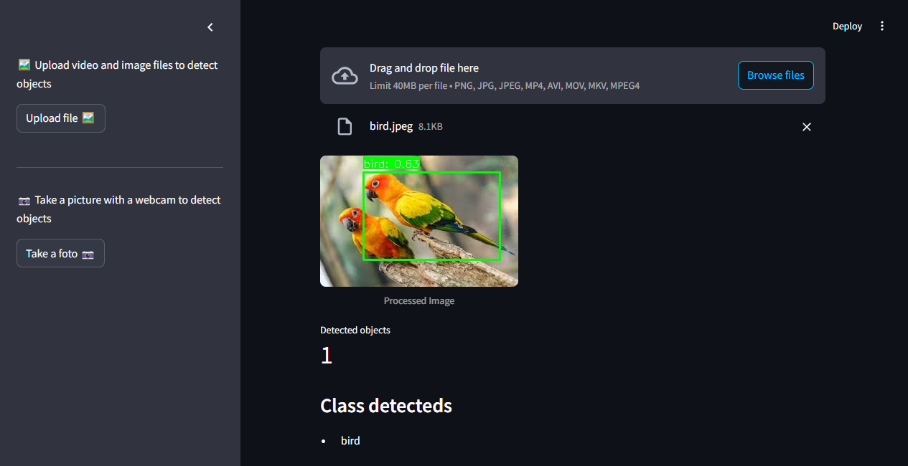
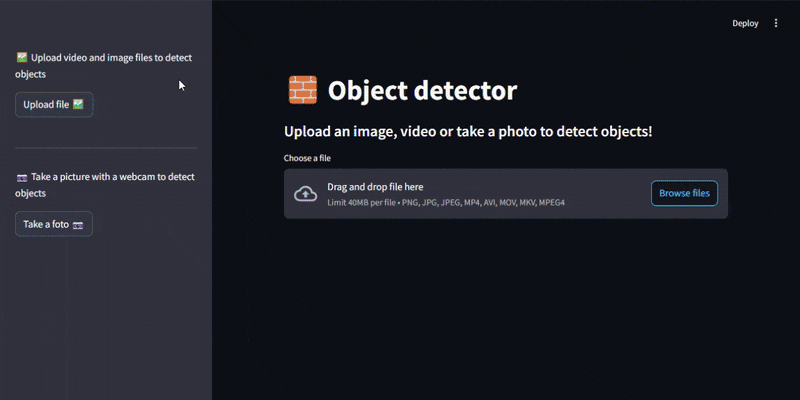

# 📷🎥 OBJECT-TRACKER-AI

This project implements object identification, both in images and videos, using the YOLO model. The capture and identification of images from the WebCam was also implemented.

## ✨ Features

- Detect objects in images and videos using YOLO v8.
- Capture images directly from a webcam for object detection.
- Display bounding boxes and labels for detected objects.
- Supports multiple file formats:
  - Images: `.jpg`, `.png`, `.jpeg`
  - Videos: `.mp4`, `.avi`, `.mov`, `.mkv`

## 📚 Resources

- [Python](https://www.python.org/downloads/)
- [PyTorch](https://pytorch.org/)
- [Streamlit](https://streamlit.io/)
- [OpenCV](https://opencv.org/)
- [YOLO v8](https://docs.ultralytics.com/models/yolov8/)

<br>


<br>

## About YOLO v8

YOLO v8 can classify the following types of objects in alphabetical order:

|             |                |                 |             |                |                  |              |                 |                 |            |
| ----------- | -------------- | --------------- | ----------- | -------------- | ---------------- | ------------ | --------------- | --------------- | ---------- |
| `airplane`  | `apple`        | `backpack`      | `banana`    | `baseball bat` | `baseball glove` | `bear`       | `bed`           | `bench`         | `bicycle`  |
| `bird`      | `boat`         | `book`          | `bottle`    | `bowl`         | `broccoli`       | `bus`        | `cake`          | `car`           | `carrot`   |
| `cat`       | `cell phone`   | `chair`         | `clock`     | `couch`        | `cow`            | `cup`        | `dining table`  | `dog`           | `donut`    |
| `elephant`  | `fire hydrant` | `fork`          | `frisbee`   | `giraffe`      | `hair drier`     | `handbag`    | `hot dog`       | `horse`         | `keyboard` |
| `kite`      | `knife`        | `laptop`        | `microwave` | `mouse`        | `motorcycle`     | `orange`     | `oven`          | `parking meter` | `person`   |
| `pizza`     | `potted plant` | `refrigerator`  | `remote`    | `sandwich`     | `scissors`       | `sheep`      | `sink`          | `skateboard`    | `skis`     |
| `snowboard` | `spoon`        | `sports ball`   | `stop sign` | `suitcase`     | `surfboard`      | `teddy bear` | `tennis racket` | `tie`           | `toaster`  |
| `toilet`    | `toothbrush`   | `traffic light` | `train`     | `truck`        | `tv`             | `umbrella`   | `vase`          | `wine glass`    | `zebra`    |

## 🥊 Image Identification vs Image Classification

Let's detail the difference between image classification and image identification (or detection):

**🔍 Image Classification:**

- **Objective**: To assign a single category or label to an entire image, determining its main content.
- **Input**: An image.
- **Output**: A single label (e.g., "cat", "car", "landscape") and usually a probability associated with that label.
- **How it works**: Neural networks, such as CNNs, analyze the image to extract relevant global and regional features that allow it to be associated with one of the predefined classes during training.
- **Example**: Given a photo of a dog, the model classifies it as "dog".

**👇 Image Identification/Object Detection:**

- **Objective**: To locate one or more instances of objects within an image and assign a label to each detected object.
- **Input**: An image.
- **Output**: A list of detected objects, where for each object its label (e.g., "car", "person"), a confidence score, and the coordinates of a bounding box indicating its position in the image are provided.
- **How it works**: More complex models, often based on CNNs (like YOLO, Faster R-CNN), perform feature extraction, propose regions of interest in the image, and for each region, classify the object present and adjust the bounding box.
- **Example**: Given a photo of a busy street, the model identifies and delimits each car, person, or traffic sign present.

In summary, classification answers "What is the main class of this image?", while identification/detection answers "Which objects are in this image and where are they?". Object identification is a more complex task as it involves both classifying and spatially locating the elements in the image.

## 🚀 Installation

Clone the repository:

```bash
git clone https://github.com/ganascimento/object-tracker-ai.git
cd object-tracker-ai
```

Make sure you have the required packages installed:

- PyTorch
- Streamlit
- opencv-python
- ultralytics

```cmd
pip install torch streamlit opencv-python ultralytics
```

## 🧪 Test/Run Project

Navigate to the `src` folder.

Run the Streamlit application:

```cmd
streamlit run main.py
```

## 🌟 Examples

### Identifying objects in images

The model can detect multiple objects in a single image and display bounding boxes with labels:

<div style="display: flex; justify-content: center; gap: 10px">
    <p align="center">
        
        <br>
        <em>Example: Detecting a dog and a cat in the same image.</em>
    </p>
    <p align="center">
        
        <br>
        <em>Example: Detecting a bird in an image.</em>
    </p>
</div>

### Object identification in video

The model processes video frames in real-time and detects objects frame by frame:

<div style="display: flex; justify-content: center; gap: 10px">
    <p align="center">
        
        <br>
        <em>Example: Detecting a dog and a cat in a video.</em>
    </p>
</div>
